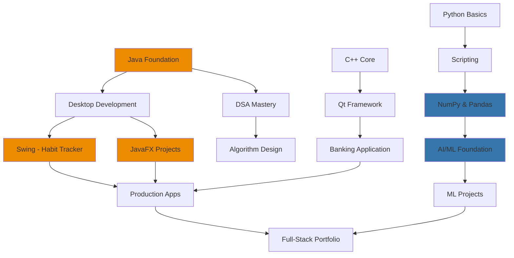

# Hey there 👋, I'm Muhammad Qasim!

<div align="center">
  


</div>

🎯 **Java-focused engineer** with strong DSA & OOP foundation  
💡 Building production-ready desktop applications (Swing, JavaFX, Qt)  
🤖 Exploring AI/ML with Python, NumPy, Pandas & Matplotlib  
⚡ Systems programming core built on C++ and Bash automation  
⌨️ **Keyboard-driven workflow obsessive** — CLI-first, mouse-optional efficiency  
🚀 Bridging theory with practical, maintainable software

📬 **Reach me at:** amkassim444@gmail.com  
💼 **GitHub:** [@Kas-sim](https://github.com/Kas-sim)

---

## ⌨️ Efficiency-Driven Workflow Philosophy

```bash
# My development environment reflects a simple principle:
# "If your hands leave the keyboard, you're losing time."

$ whoami
→ Keyboard shortcut obsessive who memorized every Windows, Arch, and browser hotkey

$ workflow --describe
→ CLI-first developer: Git commands over GUI, terminal over mouse clicks
→ Neovim devotee: hjkl navigation, zero mouse dependency
→ Automation fanatic: If it's repetitive, it gets scripted

$ efficiency --metrics
→ Windows: Win+[1-9], Alt+Tab muscle memory, PowerShell automation
→ Arch Linux: i3wm/sway bindings, terminal multiplexing, everything scriptable  
→ Browsers: Vimium-style navigation, keyboard-only browsing
→ IDEs: Custom keybindings, modal editing everywhere possible

$ philosophy
→ "Master your tools so they become invisible"
→ "The mouse is for design work, not development"
→ "Every repeated action deserves a keybinding"
```

### 🎯 Workflow Mastery Areas

<table>
<tr>
<td width="50%">

**Operating Systems**
- ⌨️ Windows shortcuts (Win+X power menu expert)
- ⌨️ Arch Linux (i3/sway window management)
- ⌨️ Terminal multiplexing (tmux/screen)
- ⌨️ Cross-OS muscle memory adaptation

</td>
<td width="50%">

**Development Tools**
- ⌨️ Git CLI fluency (never touch GUI)
- ⌨️ Neovim modal editing mastery
- ⌨️ VS Code Vim extension when needed
- ⌨️ Browser DevTools keyboard nav

</td>
</tr>
</table>

**Impact:** This keyboard-first approach translates to measurably faster coding, navigation, and task completion. Every app I use gets its shortcuts memorized within the first week.

---

## 🛠️ Core Tech Stack

<table>
<tr>
<td width="50%" valign="top">

### ☕ Java Ecosystem (Primary Focus)


- **Core Java:** Advanced OOP principles & design patterns
- **DSA Mastery:** Algorithms, data structures, problem-solving
- **Java Swing:** Production desktop apps (Habit Tracker)
- **JavaFX:** Modern UI development with FXML & CSS
- **Real Projects:** Full OOP architecture implementations

</td>
<td width="50%" valign="top">

### 🤖 AI/ML & Data Science


- **Python:** Scripting, automation, ML fundamentals
- **NumPy:** Numerical computing & array operations
- **Pandas:** Data manipulation & analysis
- **Matplotlib:** Data visualization & plotting
- **Status:** Building foundational AI/ML projects

</td>
</tr>
<tr>
<td width="50%" valign="top">

### 💻 Systems Programming


- **C++ Core:** Memory management, performance optimization
- **Qt Framework:** Cross-platform desktop applications
- **OOP Design:** SOLID principles in systems-level code
- **Banking App:** Production-grade Qt application

</td>
<td width="50%" valign="top">

### ⚙️ Workflow & Automation


- **CLI Expert:** Terminal-first workflow (Git, CMD, Bash)
- **Keyboard Ninja:** Every shortcut memorized (Windows, Arch, browsers)
- **Bash/Python Automation:** System scripting & task optimization
- **Neovim Power User:** Modal editing, zero mouse dependency

</td>
</tr>
</table>

---

## 💼 Skills Breakdown by Proficiency

```yaml
Expert Level (Production Ready):
  Java:
    - ✅ Data Structures & Algorithms (DSA)
    - ✅ Object-Oriented Programming (OOP)
    - ✅ Design Patterns & SOLID Principles
    - ✅ Java Swing - Strong proficiency
    - ✅ JavaFX - Good command with FXML
  
  C++:
    - ✅ Core language & memory management
    - ✅ Qt Framework for desktop apps
    - ✅ Systems-level programming

Intermediate Level (Active Learning):
  Python:
    - 🔄 Scripting & automation (Bash + Python)
    - 🔄 NumPy fundamentals cleared
    - 🔄 Pandas data manipulation
    - 🔄 Matplotlib visualization
    - 🔄 AI/ML concepts in progress

Supporting Tools:
  - ✅ Git CLI mastery (zero GUI dependency)
  - ✅ Windows CMD power user
  - ✅ Arch Linux terminal expert
  - ✅ Browser keyboard navigation (Vimium-style)
  - ✅ Cross-platform shortcut fluency
  - ✅ Mouse-optional efficiency mindset
```

---

## 🚀 Featured Projects

### 🎯 **Habit Tracker** — Java Swing Application
*Full-featured habit tracking desktop app demonstrating OOP mastery*

**Architecture Highlights:**
- Clean OOP design following SOLID principles
- Custom Swing components for intuitive UX
- MVC pattern for clear separation of concerns
- Persistent data storage with file I/O
- Modular, testable, and maintainable codebase

**Tech Stack:** `Java` `Swing` `OOP Design` `File I/O` `MVC Pattern`

**Skills Demonstrated:** Advanced Java, GUI development, design patterns, software architecture

---

### 🏦 **Banking Application** — C++ & Qt Framework
*Production-grade desktop application with robust data handling*

**Key Features:**
- Object-oriented architecture with SOLID principles
- Native Qt widgets for platform-consistent UI
- File-based persistence with transaction logging
- Comprehensive audit trail and data integrity
- Cross-platform compatibility (Windows, Linux)

**Tech Stack:** `C++` `Qt Framework` `OOP Design` `File Systems`

**Skills Demonstrated:** Systems programming, Qt framework, database design

---

### 📊 **Data Analysis Scripts** — Python Portfolio
*Python automation and data processing tools*

**Current Focus:**
- NumPy array operations and numerical computing
- Pandas data manipulation and analysis
- Matplotlib visualizations and plotting
- Building foundation for AI/ML projects
- Practical scripting for workflow automation

**Tech Stack:** `Python` `NumPy` `Pandas` `Matplotlib` `Jupyter`

**Skills Demonstrated:** Data science fundamentals, scientific computing, automation

---

### 📂 **Automation Suite** — Bash & Python Scripts

<details>
<summary><b>🔧 Click to expand automation projects</b></summary>

#### System Management (Bash)
- **Storage Cleanup** — Intelligent disk space reclamation
- **Storage Checker** — Real-time monitoring with alerts
- **Backup System** — Incremental backup automation

#### Python Automation
- **Data Processing** — CSV/Excel file manipulation
- **Task Automation** — Workflow optimization scripts
- **System Utilities** — Cross-platform helper tools

#### CLI Utilities
- **Number Guesser** — Interactive game with control flow
- **File Validator** — Recursive checking with reports
- **Greeter Script** — System info display

</details>

**Philosophy:** Production-ready automation saving hours of manual work.

---

## 📊 GitHub Analytics

<div align="center">


</div>

### 📈 Language Distribution (Public Repos)

<div align="center">

| Language | Proficiency | Project Count |
|----------|-------------|---------------|
| ☕ Java | ████████░░ 85% | Multiple DSA & Desktop Apps |
| 🐍 Python | ██████░░░░ 60% | ML Scripts & Automation |
| ⚙️ C++ | ███████░░░ 70% | Qt Apps & Systems |
| 📜 Bash | ██████░░░░ 65% | Automation Scripts |

</div>

> **Note:** GitHub stats may not reflect all work, especially private repositories and local projects. See projects section for comprehensive portfolio.

---

## 🎯 Current Learning Journey

<div align="center">

| 💻 Deepening Java | 🤖 Expanding AI/ML | 🏗️ Architecture |
|:----------------:|:------------------:|:----------------:|
| Advanced design patterns | ML algorithms basics | System design |
| Spring Boot framework | Neural networks | Scalable systems |
| Microservices concepts | TensorFlow/PyTorch | Cloud patterns |

</div>

---

## 💡 Technical Philosophy

> *"Learning by building, refining by breaking."*  
> *"If your hands leave the keyboard, you're losing time."*

```java
public class EngineeringPrinciples {
    private final Map<String, String> beliefs = Map.of(
        "fundamentals", "Master the basics before chasing frameworks",
        "projects", "Ship working code, not just tutorials",
        "automation", "If you do it twice, script it",
        "efficiency", "Learn every shortcut. Avoid the mouse. Stay in flow.",
        "cli_first", "Terminal over GUI. Command line over clicks.",
        "documentation", "Code explains how, comments explain why"
    );
    
    public List<String> dailyPractice() {
        return List.of(
            "Write clean, intentional code",
            "Solve DSA problems regularly",
            "Build real projects with real constraints",
            "Memorize shortcuts of every tool I touch",
            "Script repetitive tasks immediately",
            "Stay in the terminal, avoid context switching"
        );
    }
    
    public String workflowPhilosophy() {
        return "Keyboard-driven development isn't about speed—it's about " +
               "maintaining flow state. Every mouse click is a context switch.";
    }
}
```

---

## 🎓 Skills Development Roadmap



---

## 📌 Professional Summary

### 🎯 Technical Profile
```
Java Developer | DSA & OOP Expert | Desktop Applications Specialist
Python & AI/ML Enthusiast | C++ Systems Programmer  
CLI Power User | Keyboard Workflow Ninja | Arch Linux Expert
```

### 💼 Key Differentiators
- ✅ **Strong Java foundation** — DSA, OOP, design patterns expertise
- ✅ **Production applications** — Swing Habit Tracker, Qt Banking App
- ✅ **Multi-language capability** — Java, C++, Python, Bash
- ✅ **AI/ML fundamentals** — NumPy, Pandas, Matplotlib foundation
- ✅ **Keyboard-first workflow** — CLI expert, shortcut obsessive, mouse-optional
- ✅ **Systems automation** — Bash/Python scripting, terminal power user

### 🏆 Project Highlights
| Project | Tech Stack | Status |
|---------|-----------|---------|
| 🎯 Habit Tracker | Java + Swing | ✅ Complete |
| 🏦 MQ Bank | C++ + Qt | ✅ Complete |
| 📊 ML Scripts | Python + Pandas | 🔄 In Progress |
| 🔧 Automation Suite | Bash + Python | ✅ Active Use |

---

## 🤝 Open to Collaboration On

- 🏗️ **Java Desktop Applications** — Swing, JavaFX, or enterprise apps
- 🤖 **AI/ML Projects** — Learning through real-world problems
- 💻 **Systems Software** — Performance-critical C++ applications
- ⚡ **Developer Tools** — Productivity automation & workflows
- 📚 **Open Source** — Contributing to Java/Python ecosystems
- 🎓 **Mentoring** — Helping others learn OOP, DSA, and software design

---

<div align="center">

### 💬 Let's Connect

[](mailto:amkassim444@gmail.com)
[](https://github.com/Kas-sim)

---


**⚡ "Master the fundamentals. Build real projects. Ship working code."**

</div>
