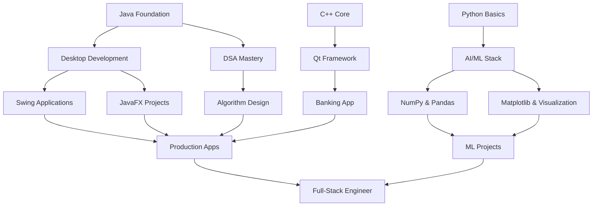

# Hey there 👋, I'm Muhammad Qasim!

<div align="center">
  


</div>

🎯 **Java-focused engineer** with strong DSA & OOP foundation  
💡 Building production-ready desktop applications (Swing, JavaFX, Qt)  
🤖 Exploring AI/ML with Python, NumPy, Pandas & Matplotlib  
⚡ Systems programming core built on C++ and terminal automation  
🚀 Bridging theory with practical, maintainable software

📬 **Reach me at:** amkassim444@gmail.com  
💼 **GitHub:** [@Kas-sim](https://github.com/Kas-sim)

---

## 🛠️ Core Tech Stack

<table>
<tr>
<td width="50%" valign="top">

### ☕ Java Ecosystem (Primary Focus)


- **Core Java:** Advanced OOP principles & design patterns
- **DSA Mastery:** Algorithms, data structures, problem-solving
- **Java Swing:** Production desktop apps with custom components
- **JavaFX:** Modern UI development with FXML & CSS styling
- **Real Project:** Habit Tracker app with full OOP architecture

</td>
<td width="50%" valign="top">

### 🤖 AI/ML & Data Science


- **Python:** Scripting, automation, and ML fundamentals
- **NumPy:** Numerical computing & array operations
- **Pandas:** Data manipulation & analysis
- **Matplotlib:** Data visualization & plotting
- **Learning Path:** Currently building AI/ML foundation

</td>
</tr>
<tr>
<td width="50%" valign="top">

### 💻 Systems Programming


- **C++ Core:** Memory management, performance optimization
- **Qt Framework:** Cross-platform native applications
- **OOP Design:** SOLID principles in systems-level code
- **Banking App:** Production-grade Qt desktop application

</td>
<td width="50%" valign="top">

### ⚙️ DevOps & Automation


- **Bash Scripting:** System automation & maintenance
- **Arch Linux:** Custom configs, package management
- **Neovim:** Keyboard-driven development workflow
- **Git:** Version control & collaborative development

</td>
</tr>
</table>

---

## 💼 Skill Progression & Focus Areas

```yaml
Primary Expertise (Production-Ready):
  Java:
    - Data Structures & Algorithms (DSA)
    - Object-Oriented Programming (OOP)
    - Design Patterns & SOLID Principles
  Desktop Development:
    - Java Swing: Strong proficiency
    - JavaFX: Good command with FXML
    - Qt (C++): Cross-platform native apps

Secondary Stack (Strong Foundation):
  Systems Programming:
    - C++: Memory management, performance
    - System-level architecture
  AI/ML Journey:
    - Python: Scripting & ML fundamentals
    - NumPy, Pandas, Matplotlib basics cleared
    - Building portfolio projects (in progress)

Supporting Tools:
  - Bash scripting for automation
  - Linux system administration
  - Terminal-first development workflow
```

---

## 🚀 Featured Projects

### 🎯 **Habit Tracker** — Java Desktop Application
*Full-featured habit tracking app demonstrating OOP mastery*

**Architecture Highlights:**
- Clean OOP design with SOLID principles
- Custom Swing components for intuitive UX
- MVC pattern for separation of concerns
- Data persistence layer with file I/O
- Modular, testable, and maintainable codebase

**Tech Stack:** `Java` `Swing` `OOP Design` `File I/O` `MVC Pattern`

---

### 🏦 **Banking Application** — C++ & Qt Framework
*Production-grade desktop application with persistent storage*

**Key Features:**
- Object-oriented architecture with SOLID principles
- Custom Qt widgets for native look-and-feel
- File-based persistence with transaction logging
- Audit trail and data integrity checks

**Tech Stack:** `C++` `Qt Framework` `OOP Design` `File Systems`

---

### 📂 **Automation Suite** — Bash Scripts Collection

<details>
<summary><b>🔧 Click to expand automation projects</b></summary>

#### System Management
- **Storage Cleanup** — Intelligent disk space reclamation with safety checks
- **Storage Checker** — Real-time monitoring with threshold alerts
- **Backup System** — Incremental backup automation with versioning

#### Utilities & Tools
- **Number Guesser** — Interactive CLI game with control flow
- **File Validator** — Recursive file checking with detailed reporting
- **Greeter Script** — Dynamic system info on terminal launch

#### Advanced Tools
- Password strength validator with entropy calculation
- Batch file processors for automation workflows
- System monitoring and alerting scripts

</details>

**Philosophy:** Production-ready automation that saves hours of manual work.

---

## 📊 GitHub Analytics

<div align="center">


</div>

---

## 🎯 Current Learning Journey

<div align="center">

| 💻 Deepening Expertise | 🤖 AI/ML Expansion | 🏗️ Architecture |
|:----------------------:|:------------------:|:----------------:|
| Advanced DSA patterns | ML algorithms & models | System design patterns |
| JavaFX mastery | Deep learning basics | Scalable architectures |
| Spring framework | Real-world ML projects | Microservices concepts |

</div>

---

## 💡 Technical Philosophy

> *"Learning by building, refining by breaking."*

```java
public class EngineeringPrinciples {
    private Map<String, String> beliefs = Map.of(
        "automation", "If you do it twice, script it",
        "documentation", "Code explains how, comments explain why",
        "tooling", "Invest in your environment, multiply your output",
        "testing", "Break it in dev, not in prod",
        "learning", "Ship projects, not tutorials"
    );
    
    public List<String> dailyPractice() {
        return List.of(
            "Write clean, intentional code",
            "Master fundamentals before frameworks",
            "Build real projects, not just tutorials",
            "Refactor before complexity grows",
            "Share knowledge through working code"
        );
    }
}
```

---

## 🎓 Skills Development Roadmap



---

## 📌 Resume Summary

### Technical Profile
```
Java Developer | DSA & OOP Expert | Desktop Apps (Swing, JavaFX, Qt)
AI/ML Learner | Python & Data Science | Systems Automation Specialist
```

### Key Differentiators
- ✅ **Strong Java fundamentals** — DSA, OOP, design patterns
- ✅ **Production desktop apps** — Swing Habit Tracker, Qt Banking App
- ✅ **Multi-paradigm developer** — Java, C++, Python
- ✅ **AI/ML foundation** — NumPy, Pandas, Matplotlib basics cleared
- ✅ **Systems automation** — Bash scripting for operational efficiency

### Project Portfolio Highlights
- 🎯 Habit Tracker (Java Swing) — Full OOP architecture
- 🏦 Banking App (C++ Qt) — Production-grade desktop software
- 📊 Data analysis scripts (Python) — Pandas & visualization
- 🔧 Automation suite (Bash) — Time-saving system scripts

---

## 🤝 Open to Collaboration On

- 🏗️ **Java Desktop Applications** — Swing, JavaFX, or cross-platform
- 🤖 **AI/ML Projects** — Learning through building real solutions
- 💻 **Systems Software** — Performance-critical C++ applications
- ⚡ **Developer Tools** — Productivity automation & workflows
- 📚 **Open Source** — Contributing to Java/Python ecosystems

---

<div align="center">

### 💬 Let's Connect

[](mailto:amkassim444@gmail.com)
[](https://github.com/Kas-sim)

---


**⚡ "Master the fundamentals. Build real projects. Ship working code."**

</div>
