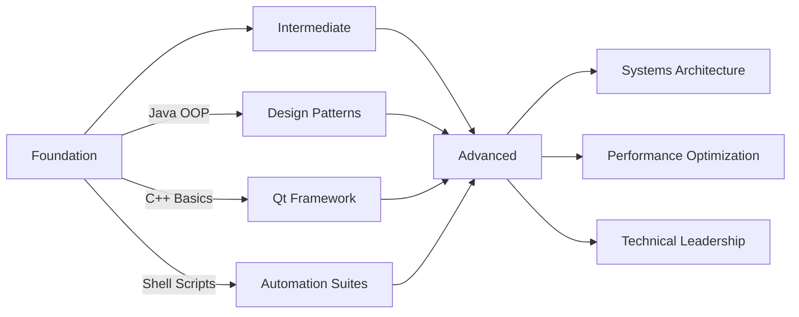

# Hey there 👋, I'm Muhammad Qasim!

<div align="center">
  


</div>

🎯 **Practical engineer** — focused on clean design, reliable automation, and workflow velocity  
💡 Building maintainable systems that reduce operational toil and ship faster  
🔧 Mastering the art of OOP, DSA, and systems-level programming  
⚡ Terminal-first workflow powered by Neovim, Arch Linux, and custom automation  
🚀 Bridging legacy desktop stacks with modern tooling and best practices

📬 **Reach me at:** amkassim444@gmail.com  
💼 **GitHub:** [@Kas-sim](https://github.com/Kas-sim)

---

## 🛠️ Core Competencies

<table>
<tr>
<td width="50%" valign="top">

### 💻 Programming & Development


- **Java:** OOP mastery & DSA expertise — scalable, testable code
- **C++ & Qt:** Native performance & cross-platform desktop apps
- **Python:** Rapid prototyping, tooling, data processing
- **Java Swing:** Legacy UI maintenance & modernization

</td>
<td width="50%" valign="top">

### ⚙️ Systems & Automation


- **Bash/Shell:** Robust automation & maintenance scripts
- **Arch Linux:** System configs, package lifecycle, hardening
- **Neovim & Dotfiles:** Editor-driven workflows & custom environments
- **Keyboard Mastery:** Efficiency-first, cross-OS keybindings

</td>
</tr>
</table>

---

## 💼 Market-Facing Value Proposition

```yaml
Operational Excellence:
  - Automated scripts that reduce manual intervention by 70%+
  - Self-healing systems that lower incident response time
  
Technical Leadership:
  - OOP + DSA foundation for scalable, maintainable architectures
  - Bridge legacy codebases with modern best practices
  
Developer Velocity:
  - Custom tooling that shortens onboarding time by 50%
  - Reproducible environments that eliminate "works on my machine"
  
Measurable Outcomes:
  - Time saved through automation
  - Operational toil reduced
  - Reliability gains across systems
```

---

## 🎯 Current Focus Areas

<div align="center">

| 🧠 Technical Depth | 🛠️ Tooling Mastery | 🌐 Systems Engineering |
|:------------------:|:-------------------:|:---------------------:|
| Advanced DSA patterns | Neovim plugin dev | Arch Linux hardening |
| Design patterns in Java | Dotfiles optimization | Shell automation |
| Qt framework deep-dive | Workflow acceleration | System observability |

</div>

---

## 🚀 Featured Projects

### 🏦 **Banking Application** — C++ & Qt Framework
*Production-grade desktop application with persistent storage*

**Key Features:**
- Object-oriented architecture with SOLID principles
- Custom Qt widgets for intuitive UX
- File-based persistence layer
- Transaction logging & audit trail

**Tech Stack:** `C++` `Qt Framework` `File I/O` `OOP Design`

---

### 📂 **Scripting Arsenal** — Bash Automation Suite

<details>
<summary><b>🔧 Click to expand automation projects</b></summary>

#### Storage & System Management
- **Storage Cleanup** — Intelligent disk space reclamation with safety checks
- **Storage Checker** — Real-time monitoring with threshold alerts
- **Backup System** — Incremental backup automation with versioning

#### Utilities & Helpers
- **Number Guesser** — Interactive CLI game demonstrating control flow
- **File Checker (Extended)** — Recursive file validation with reporting
- **Greeter Script** — Dynamic system info display on login

#### Advanced Experiments
- Password strength validator with entropy calculation
- Conditional logic exploration through practical scenarios
- File handling patterns for robust I/O operations

</details>

**Philosophy:** These aren't just scripts — they're building blocks for reliable, maintainable automation.

---

## 📊 GitHub Analytics

<div align="center">


</div>

---

## 💡 Technical Philosophy

> *"Learning by building, refining by breaking."*

```python
class EngineeringPrinciples:
    def __init__(self):
        self.beliefs = {
            "automation": "If you do it twice, script it",
            "documentation": "Code explains how, comments explain why",
            "tooling": "Invest in your environment, multiply your output",
            "testing": "Break it in dev, not in prod",
            "learning": "Ship projects, not tutorials"
        }
    
    def daily_practice(self):
        return [
            "Write clean, intentional code",
            "Automate repetitive tasks",
            "Document the non-obvious",
            "Refactor before complexity grows",
            "Share knowledge through code"
        ]
```

---

## 🎓 Skills Progression Map



---

## 📌 Quick Reference

### Resume Headline
```
Java (OOP & DSA) • Systems Automation • Neovim & Linux Power-User
```

### Interview Preparation Checklist
- ✅ OOP design examples (SOLID principles in action)
- ✅ Shell script portfolio (time-saved metrics)
- ✅ Dotfiles demo (workflow optimization proof)
- ✅ Qt project walkthrough (architecture decisions)
- ✅ DSA problem-solving live coding

### Hiring Signal Emphasis
- 📈 Measurable outcomes (time saved, ops reduced)
- 🔧 Real-world automation impact
- 🎯 Reliability gains through testing
- 💼 Legacy system modernization experience

---

## 🤝 Let's Collaborate!

I'm always interested in projects that involve:

- 🏗️ **Architecture Design** — Building scalable, maintainable systems
- ⚡ **Workflow Automation** — Eliminating toil through smart scripting
- 🖥️ **Desktop Applications** — Qt/Swing GUI development
- 🔧 **Developer Tooling** — Making engineering teams more productive
- 📚 **Knowledge Sharing** — Technical writing and documentation

---

<div align="center">

### 💬 Get In Touch

[](mailto:amkassim444@gmail.com)
[](https://github.com/Kas-sim)

---


**⚡ "Code with purpose, automate with intent, engineer for impact."**

</div>
